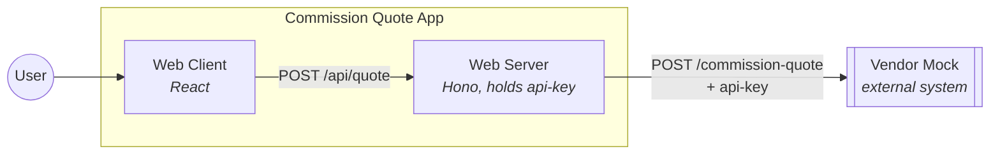

# Commission Quote App

A web app that captures loan details and returns a commission quote. The
UI and the API that holds the vendor key live in one deployable
([`web/`](web/)); the vendor is a separate process
([`commission-quote-api-mock/`](commission-quote-api-mock/)) standing in
for a real Commission Quote API that isn't built yet.

```
commission-quote-app/
├── commission-quote-api-mock/   # vendor stand-in, own process and port
│   └── src/                     # auth, pricing, random failure simulation
├── web/
│   └── src/
│       ├── client/               # React: form and quote display
│       └── server/               # Hono: holds the vendor api-key
└── sdd/
    ├── specs/                    # behaviour specs, written before the code
    └── ADRs/                     # the decisions behind them
```

## AI usage

I write the spec and the ADR before the code. Fixing the decision first
makes the whole process faster, because the context Claude works from
is already settled instead of being invented mid-task. It also cuts
down on Claude overlooking a case or hallucinating behaviour that was
never asked for, and it means every code change can be checked against
something written down, not against my memory of what I meant. The
pipeline itself — spec, then a test-writer agent, then an implementer
agent — still has a cost: for a change small enough to already be
fully scoped by its spec, splitting it across two agents took more
effort than it saved, so I paired with Claude directly on those
instead.

The specs and ADRs are in [`sdd/`](sdd/). The workflow that produced
them, including which agent writes to which folder, is in
[`CLAUDE.md`](CLAUDE.md).

## Running it

```shell
npm install && npm run install:all
cp commission-quote-api-mock/.env.example commission-quote-api-mock/.env
cp web/.env.example web/.env
npm start
```

Then open [http://localhost:5173](http://localhost:5173).

The vendor mock fails on purpose — the brief asks for an API that
occasionally throws an error at random. By default roughly one quote
request in five fails, so an error from a submit is the mock working,
not a bug. See [Seeing the failure paths](#seeing-the-failure-paths).

| Process | Port |
|---|---|
| vendor mock | `4000` |
| web server | `4001` |
| web client (Vite) | `5173` |

## Running the tests

```shell
npm test          # unit and integration, both packages
npm run typecheck # both packages
```

Contract tests make a real HTTP call, so they need the mock running —
with its random failure off, since the suite cannot tell a simulated
failure from a broken contract:

```shell
FAILURE_RATE=0 npm start --prefix commission-quote-api-mock  # one terminal
npm run test:contract --prefix commission-quote-api-mock     # another
```

## How it fits together



The browser never talks to the vendor and never sees the `api-key`.
Only [`web/src/server`](web/src/server/) does, read from its own `.env`.
`web` checks a request before it calls the vendor, and checks the
vendor's response before it shows it, because the vendor is a system
this app doesn't own. Deleting
[`commission-quote-api-mock/`](commission-quote-api-mock/) should leave
`web` compiling on its own.

## Requirements

| Requirement | Where |
|---|---|
| Form for `loanAmount`, `loanTermInMonths`, `riskBand` | [`web/src/client/QuoteForm.tsx`](web/src/client/QuoteForm.tsx) |
| Display area for a successful quote | [`web/src/client/QuoteDisplay.tsx`](web/src/client/QuoteDisplay.tsx) |
| Loading state and error messages | [`web/src/client/App.tsx`](web/src/client/App.tsx), [SPEC-009](sdd/specs/009-client-loading-and-error-states.md) |
| Vendor contract: request/response payload | [`web/src/server/contracts.ts`](web/src/server/contracts.ts), [`commission-quote-api-mock/src/app.ts`](commission-quote-api-mock/src/app.ts) |
| `api-key` required, rejected if missing or wrong | [`commission-quote-api-mock/src/middleware/auth-middleware.ts`](commission-quote-api-mock/src/middleware/auth-middleware.ts), [SPEC-002](sdd/specs/002-vendor-mock-auth-and-stub.md) |
| Vendor fails at random | [`commission-quote-api-mock/src/outcome.ts`](commission-quote-api-mock/src/outcome.ts), [SPEC-004](sdd/specs/004-vendor-mock-failures.md) |
| Invalid numbers handled | native `min`/`step` on the form, server-side bounds in [`web/src/server/contracts.ts`](web/src/server/contracts.ts), [SPEC-008](sdd/specs/008-api-error-categories.md) |
| Vendor timeout or error handled | [`web/src/server/vendor/client.ts`](web/src/server/vendor/client.ts)'s own deadline, [ADR-003](sdd/ADRs/ADR-003-first-slice-and-run-modes.md), [ADR-004](sdd/ADRs/ADR-004-error-handling.md) |
| Unit and integration tests | [`web/tests/`](web/tests/), [`commission-quote-api-mock/tests/`](commission-quote-api-mock/tests/) |
| Run instructions | this file |
| AI usage disclosed | [AI usage](#ai-usage) |

## Decisions

The brief fixes the field names and nothing else. Pricing, risk bands,
ports, and every value below are mine.

| Decision | Reason |
|---|---|
| Two packages, not three | the `api-key` forces a server side; the UI and that server share a deployable, the vendor stand-in stays fully separate so it's a clean delete later |
| Money is integer cents everywhere | a float commission rate on real money is the kind of bug that's silent until it isn't |
| The vendor client holds its own deadline (`AbortSignal.timeout`, 3s) | the mock's `504` covers a vendor that answers slowly; the deadline covers one that never answers at all |
| `web`'s own timeout answers `503`, the vendor's `504` also answers `503` | a gateway in front of `web` can itself answer `504`; reusing that status for our own timeout would make the two indistinguishable from outside |
| A vendor `401`/`403` gets the same `502` as any other vendor failure | the user can't act on either differently, and a `401` to the browser would suggest their own session expired |
| The vendor's response is validated too, not just the request | the vendor is a system I don't own, and the mock is my own guess at it |
| Invalid numbers stop at the form (`min`/`step`) and again at the server | the browser blocks a negative value before it's ever sent; the server is the actual trust boundary and doesn't trust the browser to have done that |
| Hand-written test doubles, no mocking library | a reviewer can see exactly what's faked without knowing a library's API |
| A dev mode running `web` alone against a double was built, then cut | `FAILURE_RATE=0` already gives a reliable local run; two entry points into the server wasn't worth keeping for that |

## Security

Enforced:

- The vendor requires `api-key` on every request; missing or wrong
  answers `401`. [`commission-quote-api-mock/src/middleware/auth-middleware.ts`](commission-quote-api-mock/src/middleware/auth-middleware.ts).
- The key lives only in [`web/src/server`](web/src/server/), read from
  `.env`. `.env` is gitignored; nothing in
  [`web/src/client/`](web/src/client/) references it.
- No raw vendor error body reaches the browser — logged, never
  forwarded. [`web/src/server/services/quote-service.ts`](web/src/server/services/quote-service.ts).
- Every route rejects a body over 10,000 bytes before any handler
  sees it. [`web/src/server/middleware/body-limit.ts`](web/src/server/middleware/body-limit.ts).
- A request id rides on every response, so a failure can be traced
  without logging anything sensitive alongside it. The `api-key` is
  never logged.

Deliberately absent:

- No auth on `web` itself, no rate limiting, no HTTPS termination — a
  local, single-user app for a four-hour brief, not a deployed one.
- No secrets manager. `.env` is enough at this size.

## Testing

Three levels, matching the convention in [`CLAUDE.md`](CLAUDE.md):

- **Unit** — one module, no network. Does this piece of logic behave
  correctly on its own.
- **Integration** — an endpoint as a black box, vendor client swapped
  for a hand-written double, one per error category by default —
  SPEC-008 narrows two of them (timeout, invalid response) to
  unit-only, deliberately. Does `api` sort a given vendor outcome into
  the response ADR-004 says it should.
- **Contract** — a real HTTP call against a running mock. Does the
  actual wire format match what the rest of the suite assumes.

Worth a look: [`web/tests/unit/server/vendor-client-failures.test.ts`](web/tests/unit/server/vendor-client-failures.test.ts)
runs the real 3-second `AbortSignal.timeout()` instead of a faked
clock. It proves the deadline actually fires, not just that the error
mapping downstream is correct.

## Seeing the failure paths

The mock fails roughly one request in five by default
(`FAILURE_RATE=0.2`). Turn it up to see every path sooner, or set `0`
to switch the simulation off:

```shell
FAILURE_RATE=0.8 npm start
```

A `500`, `502`, or slow response from a submit is the mock working, not
a bug. See [its README](commission-quote-api-mock/README.md#it-fails-on-purpose)
for what each outcome means.

## What I would do next

- Security hardening for a production deployment — `web` has no auth
  of its own today
- A deployment and runtime strategy — containers, health probes, CI
- Observability — structured logs, request tracing into the vendor,
  metrics
- Cross-cutting concerns like retry/backoff, shared where a second
  route would need them too
- End-to-end tests through a real browser
